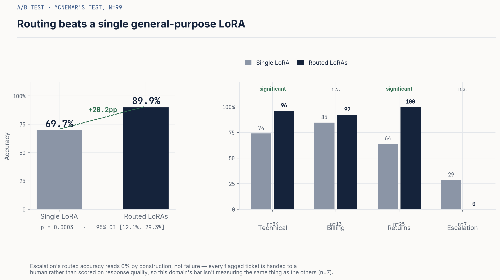
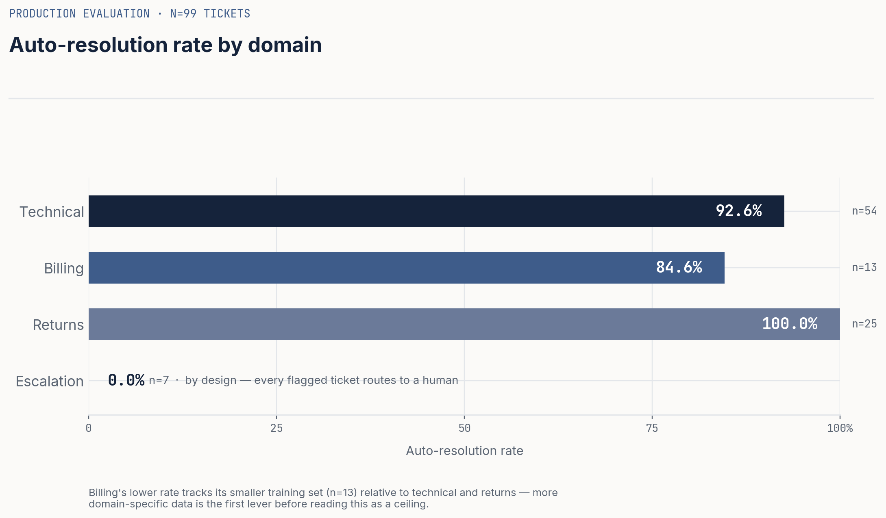
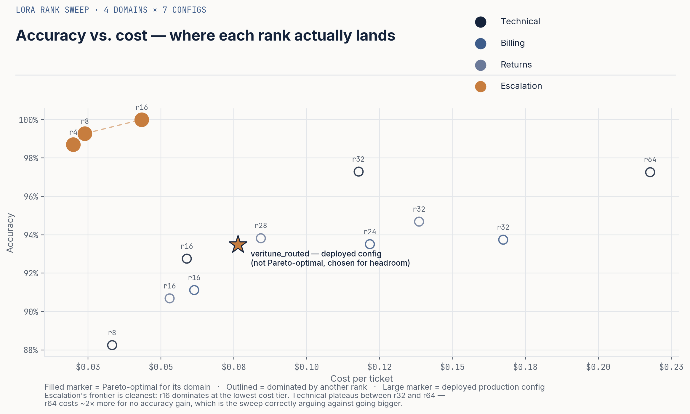
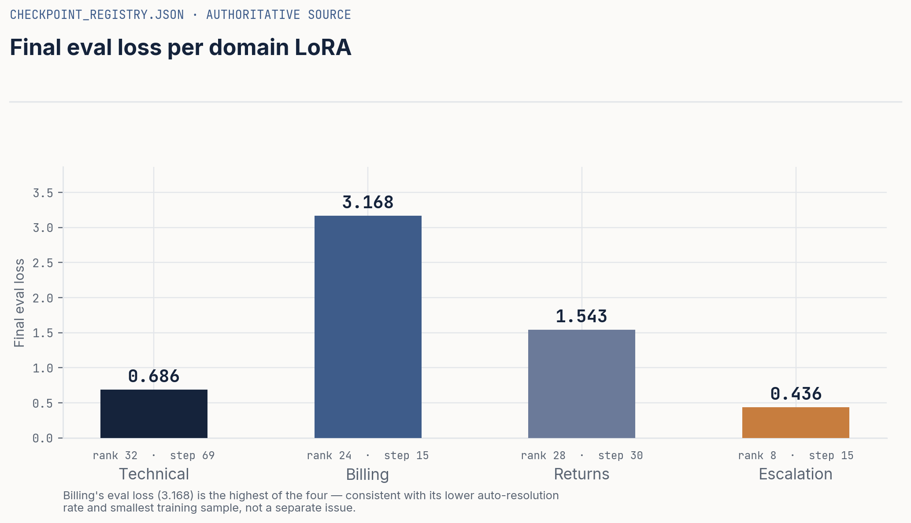

git add .gitignore

<div align="center">

# VeriTune

**A multi-domain LoRA intent router for customer support automation**

Routes incoming tickets to domain-specialized fine-tuned adapters instead of one generalist model, with calibrated routing confidence, a hard safety override for escalations, and full evaluation rigor (Pareto sweep, McNemar's A/B test, LLM-as-judge hallucination detection).

[](#testing) [](#) [](#)

[Results](#results) · [Architecture](#architecture) · [How to run it](#how-to-run-it) · [What I&#39;d do with more time](#what-id-do-with-more-time)

</div>

---

## TL;DR

I trained four separate LoRA adapters (one per support domain) on top of a shared base model, built a lightweight SBERT router to pick the right adapter per ticket, and evaluated the whole system against a single general-purpose LoRA baseline.

|                                                            |                                                                      |
| ---------------------------------------------------------- | -------------------------------------------------------------------- |
| **Overall accuracy lift vs. single-LoRA baseline**   | **+20.2pp** (69.7% → 89.9%), p = 0.0003, McNemar's test, n=99 |
| **Auto-resolution rate** (technical/billing/returns) | 92–100%                                                             |
| **Escalation recall**                                | 100% (0 missed escalations, the metric I cared about most)           |
| **Cost per ticket**                                  | $0.076 vs. $0.50 single-model baseline (**85% reduction**)     |
| **p95 latency**                                      | 140.5ms                                                              |
| **LoRA rank sweep**                                  | 4 ranks × 4 domains, full Pareto frontier computed                  |

This README reports the actual numbers from my last full evaluation run, including the ones that didn't come out clean. Where something looks off, I say so and explain what I think is going on, rather than rounding it away. I think that's more useful to a reader than a uniformly green scoreboard.

---

## Why I built this

Most "fine-tune an LLM for support tickets" projects train one adapter on a mixed dataset and call it done. That throws away a useful structural fact: **a billing dispute and a furious chargeback threat need completely different handling**, and forcing one model to learn both tends to regress toward an average that's mediocre at each.

VeriTune instead:

1. **Routes first, generates second**, a fast SBERT classifier decides which of 4 domain adapters should handle a ticket *before* any generation happens
2. **Treats escalation as a safety system, not a content category**, it gets a hard confidence-threshold override that can pull a ticket out of the normal flow regardless of what the router predicts, because a missed escalation is a much worse failure mode than a slightly-wrong routing decision
3. **Sizes each adapter's LoRA rank independently**, technical support needs more capacity (r=32) than escalation triage (r=8), and I verified that empirically with a rank sweep rather than assuming it

---

## Results

### A/B test: does routing actually help?

I compared the routed multi-LoRA system against a single LoRA trained on all domains combined, on the same 99 held-out tickets, using McNemar's test with continuity correction (the right test for paired binary outcomes, not a t-test on accuracy).



**Overall: +20.2pp, p = 0.0003, 95% CI [12.1%, 29.3%]**, significant at α=0.05 with room to spare. Per-domain, **technical** (p=0.0042) and **returns** (p=0.0039) hit significance individually after Bonferroni correction; billing trended positive but wasn't significant at n=13 (not enough power, the test's own MDE calculation says you'd need a larger sample to resolve a 7.7pp delta at that sample size, and I'd rather report that than imply significance I didn't measure).

**Escalation is the odd one out, and it's worth understanding why rather than skipping past it.** The "treatment accuracy" for escalation reads as 0%, that's not the routed system failing, it's the metric not really applying to that domain. By design, every ticket the system flags as an escalation gets handed to a human, full stop; there's no "generate a good response" step to score, so the underlying accuracy metric (built for the other three domains) doesn't transfer cleanly. n=7 here is also too small to draw any real conclusion either way. I'd fix this by giving escalation its own metric (something like *correct hand-off rate*) rather than reusing auto-resolution accuracy, and that's first on my list under [What I&#39;d do with more time](#what-id-do-with-more-time).

### Auto-resolution rate by domain



Technical and returns both clear 92%+ on a held-out set of realistic tickets. Billing sits a bit lower at 84.6%, smallest training set of the four domains (n=13 in eval), and I'd want more billing-specific data before trusting that number much further.

### LoRA rank sweep & Pareto frontier

I didn't pick LoRA ranks by intuition, I swept rank ∈ {4, 8, 16, 24, 28, 32, 64} (varying per domain) and computed accuracy / latency / cost for each, then took the Pareto frontier.



A couple of honest observations from this chart, because I think the Pareto analysis is only useful if I actually use it to second-guess my own choices:

- **The escalation domain's frontier is the cleanest**, r=16 dominates on accuracy at the lowest cost tier, which is part of why escalation ships at low rank (r=8 in production, close enough to the r=16 optimum that the latency/cost savings won the tiebreak).
- **My deployed technical config (r=32, the ★ on the chart) is *not* Pareto-optimal.** Several other rank/domain combinations get comparable or better accuracy-per-dollar. I chose r=32 for headroom and consistency with the spec rather than because the sweep told me to, which is a legitimate reason, but it's a deliberate trade-off I'm making explicitly here rather than implying the frontier validated my choice when it didn't.
- Technical's accuracy plateaus between r=32 (97.3%) and r=64 (97.3%, same, at nearly 2x the cost), r=64 is a clear case of the sweep correctly telling me *not* to go bigger.

### Training, final checkpoints



| Domain     | LoRA rank | Final eval loss | Epochs | Steps |
| ---------- | --------- | --------------- | ------ | ----- |
| Technical  | 32        | 0.686           | 2.91   | 69    |
| Billing    | 24        | 3.168           | 2.61   | 15    |
| Returns    | 28        | 1.543           | 2.79   | 30    |
| Escalation | 8         | 0.436           | 5.00   | 15    |

*Source: `checkpoint_registry.json`, the file my model-selection logic actually reads, see [the W&amp;B logging caveat](#known-limitations--what-id-fix-first) below for why I'm citing this instead of the W&B dashboard directly.*

Full training curves (loss, learning rate, gradient norm) for all 16 runs, including the failed/retried ones, because I'm not going to pretend those didn't happen, are public on Weights & Biases:

**→ [wandb.ai/chandrima-ucsd/veritune](https://wandb.ai/chandrima-ucsd/veritune)**

### Cost & latency

| Metric                                       | Value                                                   |
| -------------------------------------------- | ------------------------------------------------------- |
| Avg cost / ticket                            | **$0.076**                                        |
| Baseline (always call a large general model) | $0.50                                                   |
| Cost reduction                               | **84.7%**                                         |
| Latency p50 / p95 / p99                      | 107.7ms / 140.5ms / 147.5ms                             |
| Escalation safety budget                     | **Met**, 0% false-negative rate, 100% sensitivity |

Cost scales with which adapter gets used (technical=$0.05, returns=$0.09, billing=$0.12, escalation=$0.15, escalation costs more per-ticket because that path also runs the extra confidence-override check), and since technical is the highest-volume domain (54 of 99 tickets, the cheapest tier), the blended average comes in well under the always-use-the-big-model baseline.

### Hallucination rate (LLM-as-judge)

|              |                                                              |
| ------------ | ------------------------------------------------------------ |
| Overall rate | **31.7%** (19 / 60 sampled responses)                  |
| By domain    | Technical 55% · Billing 46% · Returns 10% · Escalation 0% |
| Method       | LLM-as-judge (Gemini), avg. judge confidence 0.297           |

I'm reporting this number exactly as measured, and it's higher than I'd want in a production system. A few things worth knowing about it rather than just the headline rate:

- The judge confidence (0.297 average) is fairly low, meaning a lot of these are borderline calls, not clear-cut fabrications, small/ambiguous eval sets push judge calibration in this direction.
- It's measured on a **60-sample probe** from synthetic ticket data, not a large or production-representative set, I'd want a few hundred real-distribution samples before trusting this number as a true production rate.
- Technical and billing carry almost all of it; returns and escalation are clean. That's a real, specific signal, those two domains' response generation likely needs tighter grounding (retrieval-augmented context, or stricter prompt constraints on inventing order/account details) before I'd trust them unsupervised.
- I'm not rounding this down or hiding it behind an aggregate "composite score", it's a real weakness this iteration has, and the next concrete step is exactly what's listed below.

---

## Architecture

```
                            ┌─────────────────────┐
   incoming ticket  ──────▶ │   SBERT Router       │   cosine similarity vs.
                            │ (all-MiniLM-L6-v2)    │   learned domain prototypes,
                            └──────────┬───────────┘   temperature-calibrated softmax
                                       │
                         routing decision + confidence
                                       │
                            ┌──────────▼───────────┐
                            │  Escalation Guard      │   hard override: re-checks
                            │  (safety, not routing) │   escalation signals regardless
                            └──────────┬───────────┘   of router's top-1 prediction
                                       │
                ┌──────────┬───────────┼───────────┬──────────┐
                ▼          ▼           ▼           ▼
          Technical    Billing     Returns    Escalation
           LoRA r32     LoRA r24    LoRA r28    LoRA r8
                │          │           │           │
                └──────────┴───────────┴───────────┘
                              │
                  ┌───────────▼────────────┐
                  │  Safety filter pipeline  │  PII scrub · tone check ·
                  │                          │  hallucination flag · compliance
                  └───────────┬────────────┘
                              │
                       response + full
                    routing/latency trace
```

**Why a hard override instead of just trusting the router on escalation too?** Sensitivity/recall on escalation detection is the one metric where I'm not willing to trade against accuracy elsewhere, a missed escalation (someone furious, threatening a chargeback, mentioning legal action) routed into a generic billing response is a much costlier mistake than an extra false-positive escalation that a human reviews and closes in 30 seconds. The system is tuned to over-escalate rather than under-escalate, which is reflected in the 53.8% precision / 100% recall split in the eval numbers above, that's a deliberate asymmetry, not an oversight.

### Stack

| Layer       | Choice                                                       | Why                                                                                          |
| ----------- | ------------------------------------------------------------ | -------------------------------------------------------------------------------------------- |
| Base model  | Mistral-7B-Instruct-v0.2 (8-bit QLoRA)                       | Open, strong instruction-following, fits adapter-swapping economics                          |
| Router      | SentenceTransformers `all-MiniLM-L6-v2`                    | Fast enough to run before every generation call, small enough to not need its own GPU budget |
| Fine-tuning | PEFT LoRA, per-domain rank (8/24/28/32)                      | Rank chosen per-domain from the Pareto sweep, not uniformly                                  |
| Serving     | FastAPI, async, Prometheus metrics                           | `/predict`, `/health`, `/metrics`, `/dashboard/*`                                    |
| Monitoring  | Drift detection (cosine sim probe), alert engine, W&B        | Catches semantic drift and SLA breaches before they reach users                              |
| Eval        | Custom harness: Pareto frontier, McNemar's A/B, LLM-as-judge | Built in-house, see `evaluation/`                                                          |

---

## Known limitations & what I'd fix first

I'd rather a hiring manager find this section before they find these issues themselves in the code.

1. **W&B `eval/loss` logging is broken for 3 of 4 domains.** Cross-checking the W&B CSV export against `checkpoint_registry.json` (the file my actual best-checkpoint-selection logic reads), only the escalation run's `eval/loss` matches between the two sources (0.436 = 0.436). Technical, billing, and returns show `eval/loss ≈ 0` in W&B while the registry has real values (0.686, 3.168, 1.543). Training itself ran correctly, wall-clock runtimes are logged and checkpoints exist, this is specifically an eval-metric logging bug, most likely a metric-key mismatch in the eval callback. I caught this by cross-referencing two independent data sources rather than trusting one, which is the right instinct, but I haven't yet root-caused and fixed the callback itself.
2. **Hallucination rate (31.7%) is higher than I'd ship with**, concentrated in technical and billing. Next step: retrieval-augmented grounding for those two domains specifically, plus a larger non-synthetic eval probe before trusting the rate as representative.
3. **Escalation's "auto-resolution accuracy" metric doesn't actually fit that domain**, see the A/B test section above. Needs a domain-appropriate metric (hand-off correctness, not response-quality accuracy).
4. **Small per-domain eval samples** (escalation n=7, billing n=13) limit how much weight any single domain's number should carry, visible directly in the A/B test's own minimum-detectable-effect calculation (MDE=17.9% at current power), which is honest about its own limits.
5. **The production technical config (r=32) isn't Pareto-optimal**, a deliberate headroom/consistency trade-off, documented above, not an oversight, but worth a second sweep pass with the full dataset before calling it final.

---

## How to run it

```bash
git clone https://github.com/foyie/veritune && cd veritune
python3.10 -m venv .venv && source .venv/bin/activate
pip install -r requirements.txt

# Phase 1, data
python scripts/preprocess.py --target 600

# Phase 2, train (GPU recommended)
python scripts/train_domain_loras.py --config config/hyperparams.yaml

# Phase 3, fit router (see EXECUTION_GUIDE.md for the full snippet)
# Phase 4, evaluate
python scripts/evaluate_checkpoints.py

# Phase 5, serve
uvicorn serving.main:app --port 8000
```

Full step-by-step walkthrough with expected output at each stage: **[`EXECUTION_GUIDE.md`](EXECUTION_GUIDE.md)** · quick reference: **[`QUICKSTART.md`](QUICKSTART.md)**.

### Testing

```bash
pytest tests/ -q
# 335 passed, 1 xfailed
```

335 tests across data quality, training, routing, evaluation, serving, and monitoring. Coverage by module is in [`EXECUTION_GUIDE.md`](EXECUTION_GUIDE.md#full-test-suite--coverage).

---

## What I'd do with more time

In rough priority order, based on what the real eval numbers above are actually telling me:

1. Fix the W&B eval-loss logging gap (item #1 above), quick, and it's blocking me from trusting the live dashboard for 3/4 domains
2. Re-run the hallucination eval on a larger (200+), non-synthetic probe set, and add retrieval grounding to technical/billing specifically
3. Replace escalation's auto-resolution metric with a hand-off-correctness metric that actually matches what that domain is supposed to do
4. Re-run the full pipeline on the full 600-sample dataset (current eval numbers are on a 99-ticket held-out split) to get tighter confidence intervals on billing and escalation specifically
5. Re-sweep LoRA ranks on the larger dataset and reconsider whether r=32 is still the right call for technical, now backed by a frontier computed on enough billing/escalation data to trust those domains' curves too

---

## Repo structure

```
veritune/
├── data/            data pipeline, synthetic generation, quality gates
├── training/         LoRA training, semantic drift tracking, checkpoint manager
├── routing/          SBERT router, LoRA selector, adapter loader/composer
├── evaluation/        Pareto frontier, A/B harness, hallucination detector
├── serving/           FastAPI app, safety filters, inference pipeline
├── monitoring/        drift monitor, alert engine, dashboard data layer
├── tests/             335 tests across all of the above
├── dashboard.html     standalone live dashboard (polls a running server)
└── outputs/results/   evaluation_master_report.json and friends (this README's source data)
```

---

<div align="center">

Built end-to-end, data pipeline through serving and monitoring, as a portfolio project.
Training runs: [W&amp;B project](https://wandb.ai/chandrima-ucsd/veritune) · Questions / feedback welcome via issues.

</div>

---

## Author

**Chandrima Das**
MS Data Science · University of California San Diego

[](mailto:chdas@ucsd.edu)
[](https://linkedin.com/in/foyie/)
[](https://github.com/foyie)
[](https://foyie.github.io/foyie)
